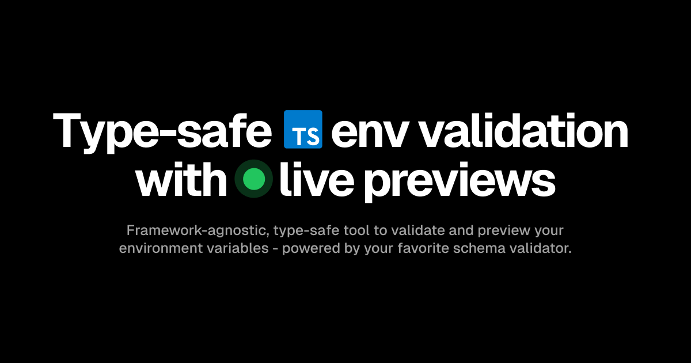

## Installation

> [!NOTE]
>
> This is an ESM only package that requires a tsconfig with a module resolution that can read package.json#exports (`NodeNext` if transpiling with `tsc`, `Bundler` if using a bundler).

```bash
# Core package, no framework specific features
bun add envin

# CLI, used e.g. for live previews
bun add @envin/cli
```

For full documentation, see https://envin.turbostarter.dev

## Usage

> [!NOTE]
>
> You may use any [Standard Schema](https://github.com/standard-schema/standard-schema) compliant validator of your choice.

This package supports the full power of [most popular schema libraries](https://github.com/standard-schema/standard-schema?tab=readme-ov-file#what-schema-libraries-implement-the-spec), meaning you can use `transforms` and `default` values.

### Define your schema

```ts
// env.config.ts
import { defineEnv } from "envin";
import { z } from "zod";

export const env = defineEnv({
  /*
   * Serverside Environment variables, not available on the client.
   * Will throw if you access these variables on the client.
   */
  server: {
    DATABASE_URL: z.string().url(),
    OPEN_AI_API_KEY: z.string().min(1),
  },
  /*
   * Environment variables available on the client (and server).
   *
   * 💡 You'll get type errors if these are not prefixed with NEXT_PUBLIC_.
   */
  client: {
    NEXT_PUBLIC_CLERK_PUBLISHABLE_KEY: z.string().min(1),
  },
  /*
   * Due to how Next.js bundles environment variables on Edge and Client,
   * we need to manually destructure them to make sure all are included in bundle.
   *
   * 💡 You'll get type errors if not all variables from `server` & `client` are included here.
   */
  env: {
    DATABASE_URL: process.env.DATABASE_URL,
    OPEN_AI_API_KEY: process.env.OPEN_AI_API_KEY,
    NEXT_PUBLIC_CLERK_PUBLISHABLE_KEY:
      process.env.NEXT_PUBLIC_CLERK_PUBLISHABLE_KEY,
  },
});
```

### Use the schema in your app with autocompletion and type inference

```ts
// src/app/hello/route.ts
import env from "env.config";

export const GET = (req: Request) => {
  const DATABASE_URL = env.DATABASE_URL;
  // use it...
};
```

## Live Preview

One of the most powerful features of this package is the ability to preview your environment variables in a livemode.

```bash
# Run the CLI with your env.config.ts file
npx @envin/cli@latest dev
```

This will start a live preview server that will automatically update your environment variables when you change them allowing you to find and fix errors before deploying your app.
